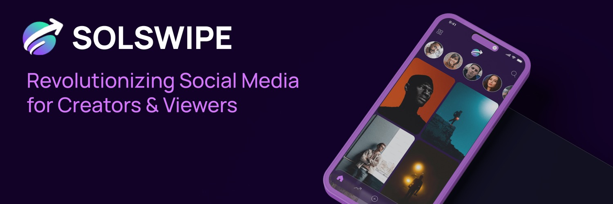

# Welcome to SolSwipe! 🚀📱

## Who Are We? 🌟

SolSwipe is revolutionizing social media on the blockchain. Built on Solana, we offer a platform where creators can share, engage, and earn in a fully decentralized environment. Say goodbye to manipulation and hello to a new era of content creation and consumption!

## Features ✨

- **Super Like**: Show your love by tipping creators with $swipes!
- **Personalization**: Enjoy content tailored just for you with our cutting-edge AI.
- **Earn**: Share in the revenue from all monetization activities simply by holding tokens!

## Updates 📅

Here, we'll share regular updates on our journey, including new features, partnerships, and milestones. Stay tuned!

## Get Involved 🤝

Want to contribute? Here's how you can be a part of our journey:

- **Developers**: Help us enhance the platform by contributing code.
- **Creators**: Create engaging content and grow with us.
- **Supporters**: Spread the word and help us revolutionize social media.

## Connect With Us 📬

- [Twitter](#)
- [Instagram](#)
- [Discord](#)

Join us on this incredible adventure to democratize social media, powered by blockchain. Let's make history together with SolSwipe!